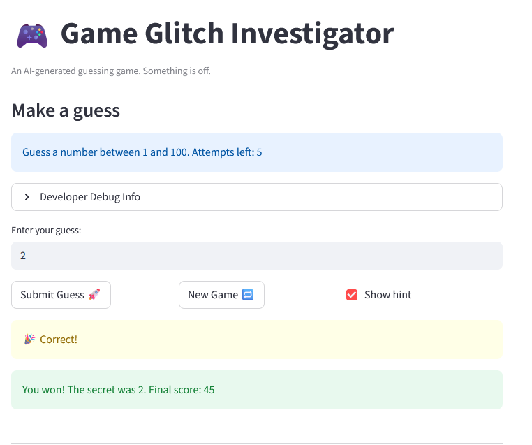

# 🎮 Game Glitch Investigator: The Impossible Guesser

## 🚨 The Situation

You asked an AI to build a simple "Number Guessing Game" using Streamlit.
It wrote the code, ran away, and now the game is unplayable. 

- You can't win.
- The hints lie to you.
- The secret number seems to have commitment issues.

## 🛠️ Setup

1. Install dependencies: `pip install -r requirements.txt`
2. Run the broken app: `python -m streamlit run app.py`

## 🕵️‍♂️ Your Mission

1. **Play the game.** Open the "Developer Debug Info" tab in the app to see the secret number. Try to win.
2. **Find the State Bug.** Why does the secret number change every time you click "Submit"? Ask ChatGPT: *"How do I keep a variable from resetting in Streamlit when I click a button?"*
3. **Fix the Logic.** The hints ("Higher/Lower") are wrong. Fix them.
4. **Refactor & Test.** - Move the logic into `logic_utils.py`.
   - Run `pytest` in your terminal.
   - Keep fixing until all tests pass!

## 📝 Document Your Experience

- [ ] Describe the game's purpose.

The goal of this game is to find the secret number in a certain amount of attempts. There is optional hint that tells whether to go higher or lower. 

- [ ] Detail which bugs you found.

Some bugs I found were that one the go higher and go lower hints were doing opposite tasks. When the user had to actually go lower to get the secret number it instead said go higher and vice versa. Another bug that I found was that the user can't click new game either during the round or after the game was finished. 

- [ ] Explain what fixes you applied.

I used github copilot and I noticed that the bug was occurring in app.py. So I used the # FIXME: and told copilot to make changes to the go higher and go lower functions as they were doing the opposite tasks. I also told copilot that the new game button was bugged and nothing happened and to write code for the button.

## 📸 Demo

- [ ] [Insert a screenshot of your fixed, winning game here]

## 🚀 Stretch Features

- [ ] [If you choose to complete Challenge 4, insert a screenshot of your Enhanced Game UI here]
